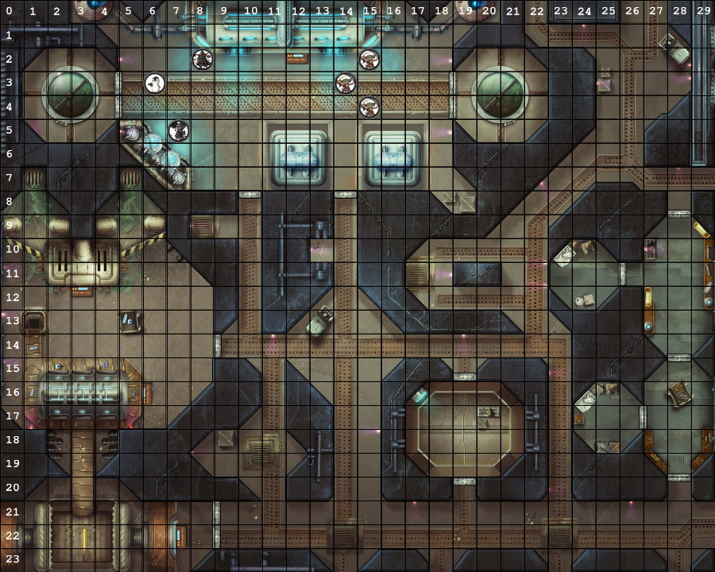

# DTRE - Discord Tabletop RPG Engine

DTRE is a tabletop rpg engine to be used in discord. If you're tired of complicated tools, but want some more functionality and want a simple streamlined roleplaying experience directly on discord, with no external apps, and that can be easily playable on mobile search no further.

## Support
If you like this bot and want to support this work, buy me a coffee! 

## How to Add to you Server
Just click [HERE!](https://discord.com/oauth2/authorize?client_id=720085008710369370&permissions=10240&scope=bot)!

## Usage
The bot responds to user commands on text channels. You can:

* Roll dice
* Create a Scenario
* Add Tokens on the Scenario
* Move Tokens
 
To invoke a bot command, just use one of the prefixes bellow:
* !dtre.
* ?dtre.
* !r.
* ?r.
