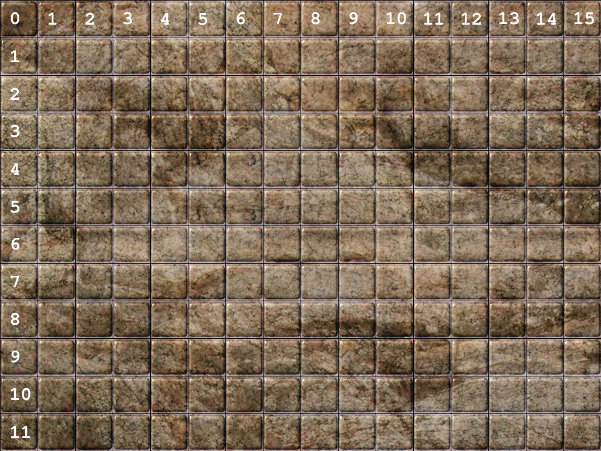

# DTRE - Discord Tabletop RPG Engine  
  
DTRE is a tabletop rpg engine to be used in discord. If you're tired of complicated tools, but want some more functionality and want a simple streamlined roleplaying experience directly on discord, with no external apps, and that can be easily playable on mobile search no further.  
  

  
## How to Add to you Server  
Still in development...  
  
## Usage  
The bot responds to user commands on text channels.  
The prefix for all of the commands can be  
* !dtre.  
* ?dtre.  
* !r.  
* ?r.  
  
For Example:  
```
?dtre.create myscenario
```
that's the sintax of the "create" command.  
  
## Commands  
Here's a list with all the commands the bot responds.

* **rualive** 
<br>
    **aliases:** none
    <br>
    **parameters:** none
    <br>
    **description:** Just a simple command to test if the bot is alive.
    <br>
    **response:** message: ```"Yes, i'm alive!"```
    <br>

* **create**
<br>
    **aliases:** c
    <br>
    **parameters:** 
    <br>
	* **name**: str 
	the name of the scenario  
	* (optional) **image_url**: str <br>
	the url off the background image for the scenario to be created
	* (optional) **square_size_pixels:** int -> Defaut: 60 <br>
	the size in pixels for the squares of the map
	* (optional) **offset_pixels_left:** int -> Default: 0 <br>
	offset in pixels from the left side of the image to start making the squares
	* (optional) **offset_pixels_top:** int -> Default: 0 <br>
	offset in pixels from the top side of the image to start making the squares
	
    **description:**
    Creates a scenario with the specified name
    <br>
    Examples:  
    ```
    ?r.c mydungeon  
    ?r.c "just a bridge" https://i.imgur.com/G5kc4QX.jpg 45 17 17
    ```
    **response:** The map of the scenario. If only the name is passed, the default map is created
    
    
    
* **save**
<br>
**aliases:** s
<br>
**parameters:** none
<br>
	**description:**
	Saves the scenario in json form to be loaded later
	<br>
	Examples:  
    ```
    ?r.s
    ?r.save
    ```
    **response:** The json of the scenario
    <br>
    Ex: 
    ```json
    {"name": "teste", "map": {"image_url": null, "offset": [0, 0], "square_size": 64}, "characters": [{"name": "zezo", "token": {"position": [8, 2], "image_url": "https://i.pinimg.com/originals/f1/77/53/f177537621e9225d22b87f3269afb901.jpg", "frame_url": "image/files/default_token_frame.png"}}, {"name": "g3", "token": {"position": [15, 4], "image_url": "https://starfinderwiki.com/mediawikisf/images/thumb/8/8d/Space_goblin.jpg/250px-Space_goblin.jpg", "frame_url": "image/files/default_token_frame.png"}}]}
    ```

* **load**
<br>
**aliases:** l
<br>
**parameters:** none
<br>
	**description:**
	Loads the scenario from a json
	<br>
	Examples:  
    ```
    ?r.l {"name": "teste", "map": {"image_url": null, "offset": [0, 0], "square_size": 64}, "characters": [{"name": "zezo", "token": {"position": [8, 2], "image_url": "https://i.pinimg.com/originals/f1/77/53/f177537621e9225d22b87f3269afb901.jpg", "frame_url": "image/files/default_token_frame.png"}}, {"name": "g3", "token": {"position": [15, 4], "image_url": "https://starfinderwiki.com/mediawikisf/images/thumb/8/8d/Space_goblin.jpg/250px-Space_goblin.jpg", "frame_url": "image/files/default_token_frame.png"}}]}
    ```
    **response:** The loaded scenario
    <br>

* **add_character**
<br>
**aliases:** ac, addcharacter, addchar, add_char
<br>
**parameters:**
<br>
    * **name**: Name of the character
    * **position_x**: position for the character token in the map on the x axis (from left)
    * **position_y**: position for the character token in the map on the y axis (from top)
    * **url**: url of the image to be used as token (The image will be resized and cropped to a circle and put in 
    a frame)
    * (Optional) **size_x**: the size in map squares of the token in the x axis (not supported yet, omit this parameter)
    * (Optional) **size_y**: the size in map squares of the token in the y axis (not supported yet, omit this parameter)
	
	**description:**
	Adds a character to the scenario
	<br>
    Examples:  
    ```
    ?r.ac goblin 3 4 https://starfinderwiki.com/mediawikisf/images/thumb/8/8d/Space_goblin.jpg/250px-Space_goblin.jpg
    ```
    **response:** The scenario with the added token
    <br>

* **remove_character**
<br>
**aliases:** rc, removecharacter, removechar, remove_char
<br>
**parameters:**
<br>
    * **name**: Name of the character
	
	**description:**
	Removes a character from the scenario
	<br>
    Examples:
    ```
    ?r.rc goblin
    ```
    **response:** The scenario without the removed token
    <br>
    
* **move_character**
<br>
**aliases:** m, mc, move_char, movecharacter, move
<br>
**parameters:**
<br>
    * **name**: Name of the character
    * **movement**: the movement of the character as described in the command description
	
	**description:**
	Moves a character <br>
    The movement is defined by directions separated by spaces,
    the directions can be the orthogonal (u = up, l = left, d = down, ur = righ) or
    any combination of two orthogonal direction to for a diagonal (ex: ul for up-left)
	<br>
    Examples:
    ```
    ?r.m valkor l lu l lu l l
    ```
    **response:** The scenario with the token moved
    <br>

* **roll**
<br>
**aliases:** r
<br>
**parameters:**
<br>
    * **roll**: The dice roll in dice notation
    * (Optional) **target**: The target value
	
	**description:**
	Makes a dice roll indicated by the sent string in dice roll notation
    xdy±z, where "x" is the quantity of dice, "y" is how many face the dice have
    and you can add or subtract a modifier "z"
	<br>
    Examples:
    ```
    ?r.r 1d20+10 15
    ?r.r 2d8+5
    ```
    **response:** The result of the roll, with all the details.
    <br>