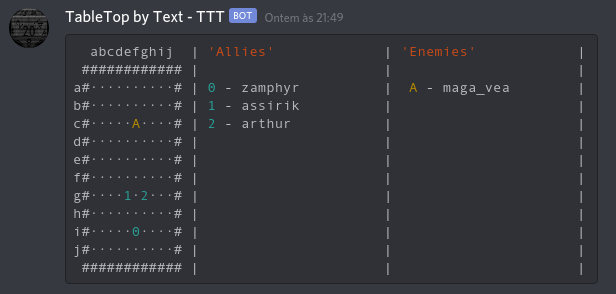

#DTRE - Discord Tabletop RPG Engine
DTRE is a tabletop rpg engine to be used in discord. If you're tired of complicated tools, but want some more functionality and want a simple streamlined roleplaying experience directly on discord, with no external apps, and that can be easily playable on mobile search no further.

This project is in its early stages, i will still make a more thorough documentation available. But you currently can create a battle grid for your game and move the pieces just with chat commands

