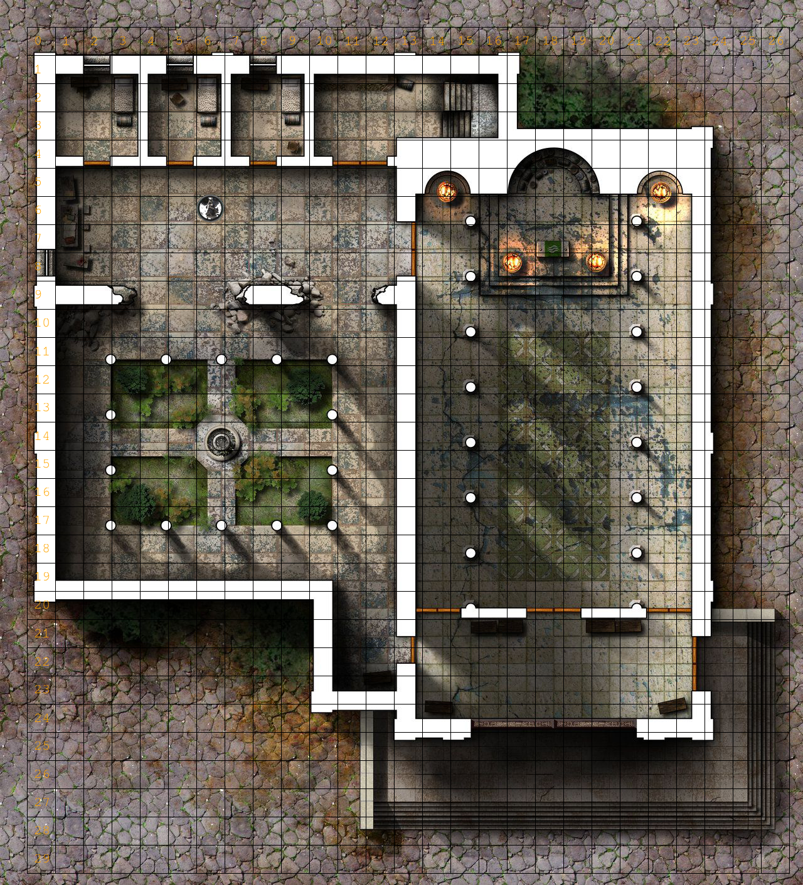

# DTRE - Discord Tabletop RPG Engine  
  
DTRE is a tabletop rpg engine to be used in discord. If you're tired of complicated tools, but want some more functionality and want a simple streamlined roleplaying experience directly on discord, with no external apps, and that can be easily playable on mobile search no further.  
  
  
  
## How to Add to you Server  
Still in development...  
  
## Usage  
The bot responds to user commands on text channels.  
The prefix for all of the commands can be  
* !dtre.  
* ?dtre.  
* !r.  
* ?t.  
  
For Example:  
```
?dtre.create myscenario
```
that's the sintax of the "create" command.  
  
## Commands  
Here's a list with all the commands the bot responds.

* **rualive**
**aliases:** none
**parameters:** none
**description:**
Just a simple command to test if the bot is alive.  
**response:**
message: "Yes, i'm alive!"  
  
* **create**
**aliases:** c
**parameters:**  
	* **name**: str 
	the name of the scenario  
	* (optional) **image_url**: str
	the url off the background image for the scenario to be created
	* (optional) **square_size_pixels:** int
	the size in pixels for the squares of the map
	* (optional) **offset_pixels_left:** int
	offset in pixels from the left side of the image to start making the squares
	* (optional) **offset_pixels_top:** int
	offset in pixels from the top side of the image to start making the squares
	
	**description:**
	Creates a scenario with the specified name  
	Examples:  
	```
	?r.c mydungeon  
	?r.c "just a bridge" https://i.imgur.com/G5kc4QX.jpg 45 17 17
	```
* **set_offset**
**aliases:** so, setoffset, offset
**parameters:**  
	* **name**: str 
	the name of the scenario to be changed
	* **offset_pixels_left:** int
	offset in pixels from the left side of the image to start making the squares
	* **offset_pixels_top:** int
	offset in pixels from the top side of the image to start making the squares

	**description:**
	Sets the offset in pixels for the name scenario
	Examples:  
	```
	?r.setoffset mydungeon 14 14
	```

* **set_square_size**
**aliases:** sqs, setsquaresize, squaresize
**parameters:**  
	* **name**: str 
	the name of the scenario to be changed
	* **square_size_pixels:** int
	the size in pixels for the squares of the map

	**description:**
	Sets the square size in pixels for the named scenario
	Examples:  
	```
	?drpge.set_quare_size mydungeon 50
	```
